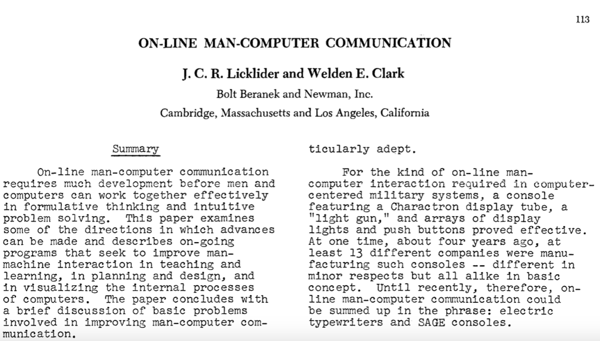
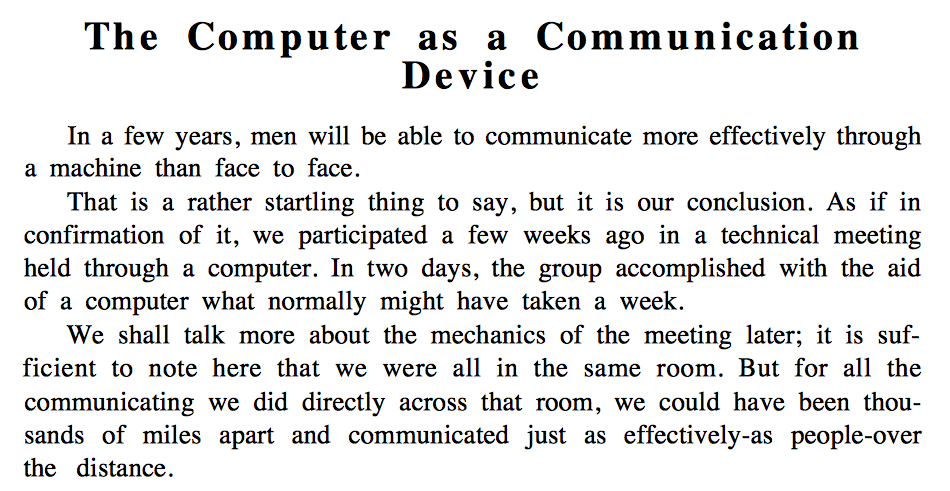
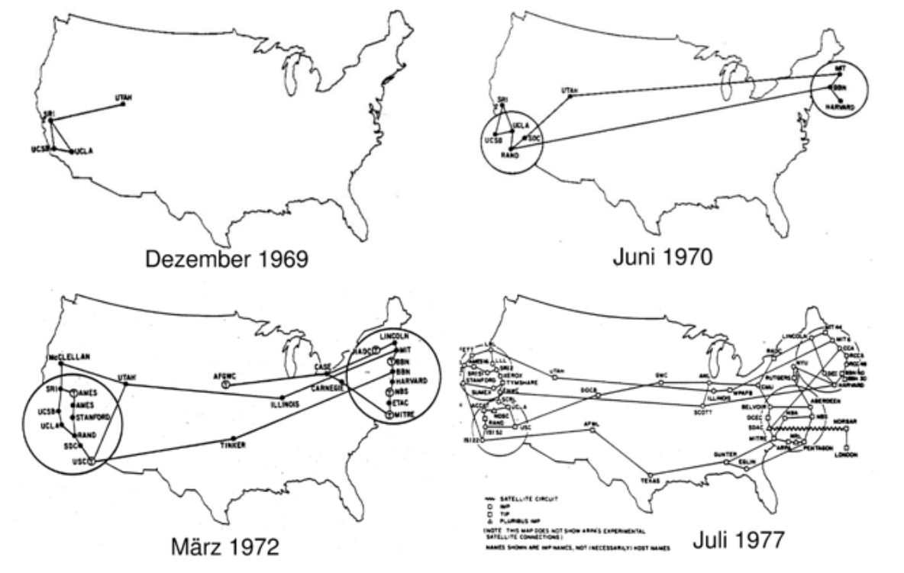
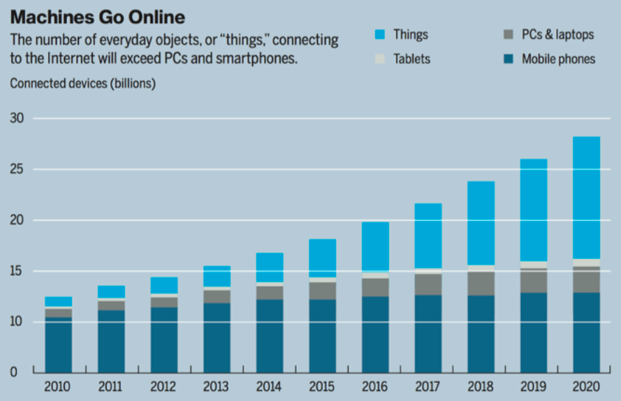
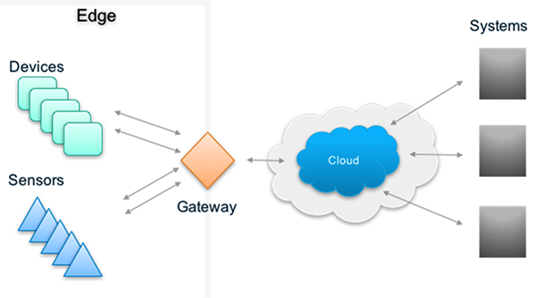

# warning: we'll go fast!

{width=80%}

# visionaries I

> On-line Man-Computer Communication, 1962

{width=80%}

# visionaries II

> The Computer as a Communication Device - J.C.R. Licklider & Robert
> Taylor, 1968

{width=80%}

# Arpanet

{width=80%}

# why more protocols?

{width=75%}

# connected devices I

{width=80%}

> MIT Technology Review, 2014

# connected devices II

* 14 bn connected devices | Bosch SI
* 50 bn connected devices | Cisco
* 309 bn IoT supplier revenue | Gartner
* 1.9 tn IoT economic value add | Gartner
* 7.1 tn IoT solutions revenue | IDC
 

# device cost & connectivity

> By 2020, component costs will have come down to the point that
> connectivity will become standard feature, even for 
> processors costing **less than $1**.
>
> Peter Middleton - Gartner

# constrained devices

* IETF Definition: **[`tools.ietf.org/html/rfc7228`](https://tools.ietf.org/html/rfc7228)**
* limited processing power
* unreliable networking
* low power _(so they can run on batteries)_

# internet: a definition

 
 

> "A computer network consisting of a worldwide network of computer networks that use the TCP/IP network protocols to facilitate data transmission and exchange."

# **edge** has devices - **cloud** has servers

{width=80%}

# edge 

devices $\neq$ gateways

 

* devices talk to other **devices northbound and southbound** 
* gateways talk to the **cloud northbound and devices southbound**
* device to device **(d2d)**
* device to cloud **(d2c)**

