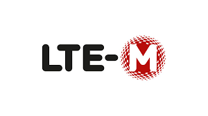
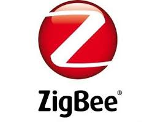
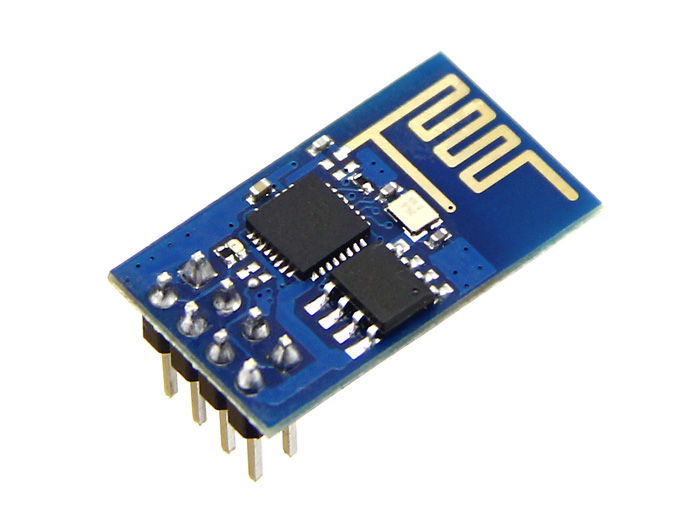
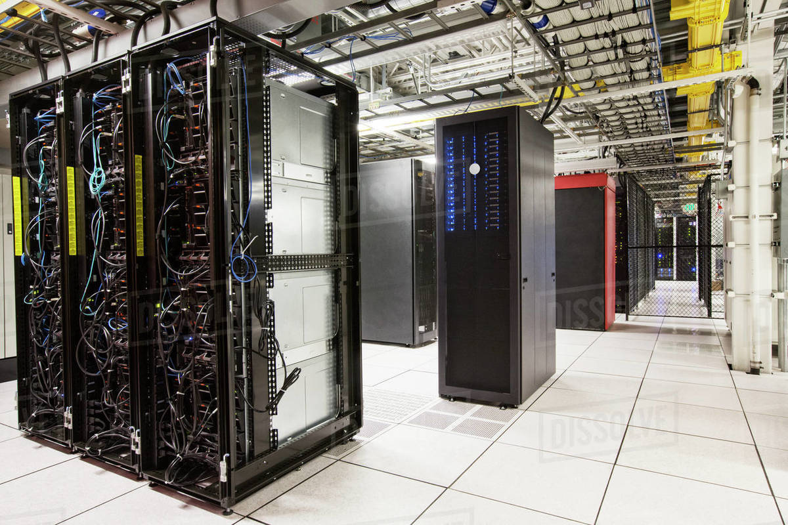
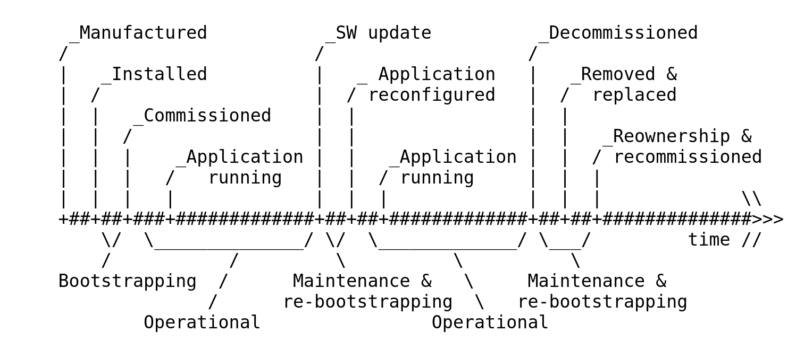

# security considerations I: logo soup

<!--  set 1 -->
{width=20%}
{width=20%}
{width=20%}
{width=20%}
<!-- set 2 -->
{width=20%}
{width=20%}
{width=20%}
{width=20%}
<!-- set 3 -->
{width=20%}
{width=20%}
{width=20%}
{width=20%}
<!-- set 4 -->
{width=20%}
{width=20%}
{width=20%}
{width=20%}

# security considerations II: system heterogeneity

{width=50%}
{width=50%}

# security considerations III: Thing lifecycle 

{width=100%}

# further reading on IoT security

> State-of-the-Art and Challenges for the Internet of Things Security

[https://datatracker.ietf.org/doc/draft-irtf-t2trg-iot-seccons/?include_text=1](https://tools.ietf.org/html/draft-irtf-t2trg-iot-seccons-15)

 * provides in depth discussion of IoT security considerations
 * references many other IETF working groups
 * inspiration for IoT security comes mostly from web
 * takes into account the fact that the devices are much more constrained
 * critical applications 
