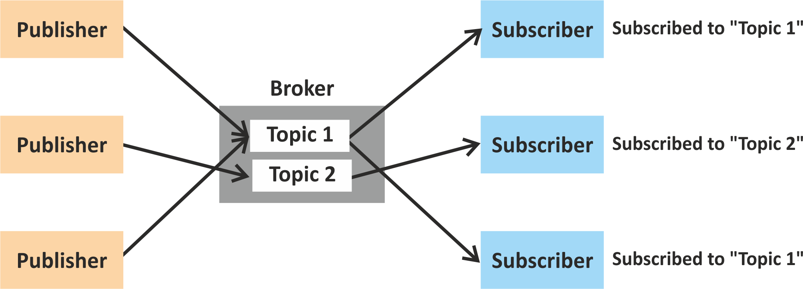
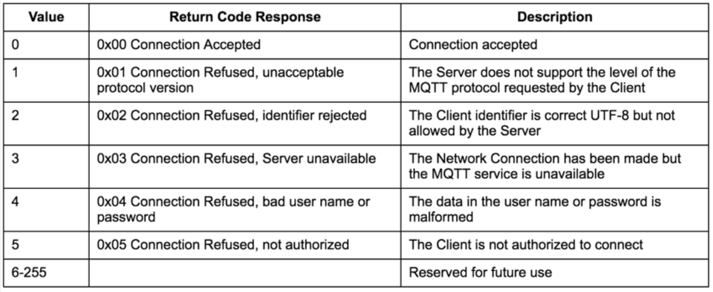
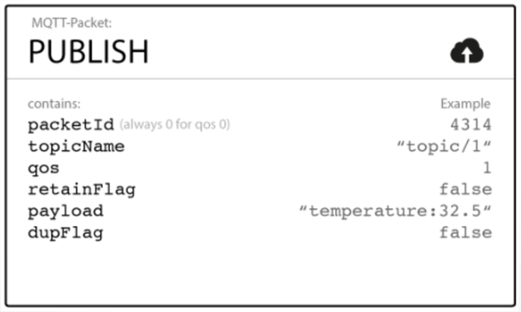
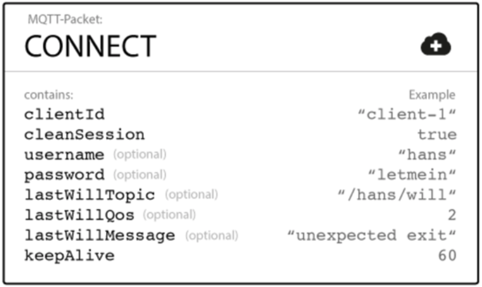

# MQTT I: basics

**M**essage **Q**ueue **T**elemetry **T**ransport

_"Publish-subscribe-based "lightweight" messaging protocol, for use on top of the TCP/IP protocol."_

* Publish-subscribe
* A **message broker** is required
* Standard: ISO/IEC PRF 20922
* Small code footprint
* Limited network bandwidth / constrained environments
* Developed in 1999 (and released royalty free in 2010)
* Data agnostic

# MQTT II: publish-subscribe model

{width=100%}

# MQTT III: connecting to the broker

{width=100%}

# MQTT IV: publishing to a topic

{width=50%}

# MQTT V: subscribing to a topic

## example topics

* topic #1: `home/groundfloor/kitchen/temperature`
* topic #2: `office/conferenceroom/luminance`

## wild cards

* single-level: `home/groundfloor/+/temperature`  
_(to subscribe to **all the temperature readings** in all the rooms of the ground floor)_
* multi-level: `home/groundfloor/#`  
_(to subscribe to **all the readings** in all the rooms of the ground floor, **not only the temperature**)_

# MQTT VI: **Q**uality **o**f **S**ervice

## QoS can be 0, 1, or 2

* 0: the broker/client will deliver the message once, with no confirmation.
* 1: the broker/client will deliver the message at least once, with confirmation required.
* 2: the broker/client will deliver the message exactly once by using a four step handshake.

# MQTT VII: last will and testament

{width=50%}

# MQTT security highlights

* MQTTS: MQTT over **TLS**
* **Basic Authentication** like in HTTP (password/user)
* broker constitutes **S**ingle **P**oint **o**f **F**ailure (SPOF)

# MQTT 5: what's new highlights I

 * jump from 3.1.1 to 5 is due to single byte for version in frame
 * **metadata** can now be embedded in a published message: **user properties**
 * **reason codes**: kind-of-status codes for CoAP and HTTP
 * **shared subscriptions**: client load balancing
 
# MQTT 5: what's new highlights II

 * optional `Content-Type` header (MIME)
 * **message format**: 1 means UTF8 encoded, 0 other type of data
 * **topic aliasing**
 * `AUTH` packet for other authentication schemes besides basic
 * **request/response** communication pattern
 
# MQTT 5: state of implementations I

 * [VerneMQ](vernemq.com): currently stable version supports most of
   MQTT5 features
 * written in **Erlang**: high performance
 * supports server side **Lua** scripting
 * *probably* the most standards compliant implementation out there
 * **free software**: available on [github](https://github.com/vernemq/vernemq)
 
# MQTT 5: state of implementations II
   
 * the C written **mosquitto ([mosquitto.org](https://mosquitto.org))** has now a
   branch where some of the version 5 features are being implemented
 * lagging VerneMQ 
 * requires re-architecting the mosquitto library that is used in many
   sofware projects

# MQTT VIII: learn more

There are client libraries and wrappers for practically all languages used in M2M setups, as well as different brokers/servers.

* learn more: **[mqtt.org](http://mqtt.org)**
* software: **[mqtt.org/software](http://mqtt.org/software)**
* lots of good tutorials out there

