# CoAP I: basics

> A specialized web transfer protocol for use with constrained nodes and constrained networks.
>
> RFC 7252 - **Co**nstrained **A**pplication **P**rotocol

# CoAP development

* CoRE, IETF group
* Proposed standard: RFC 7252
* **CoAP ~ lightweight fast HTTP**
* Designed for manipulation of simple resources on constrained node networks

# CoAP II: RESTful environment


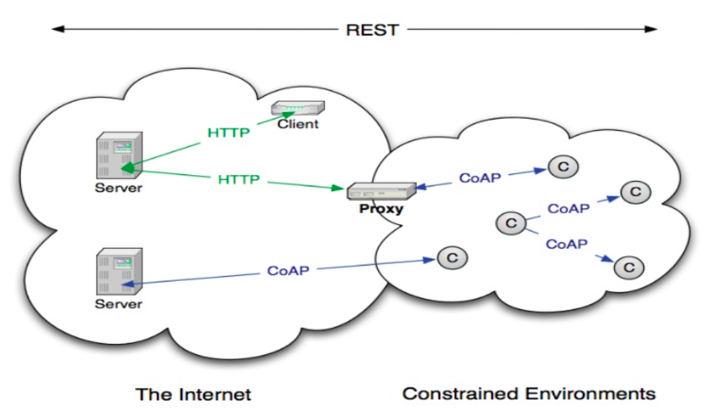{width=80%}


# CoAP III: inspired by HTTP

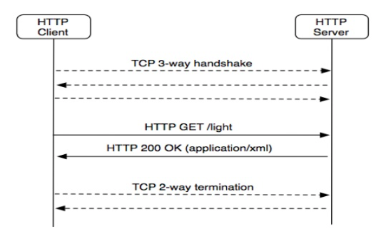{width=80%}

# CoAP IV: proxying with HTTP 

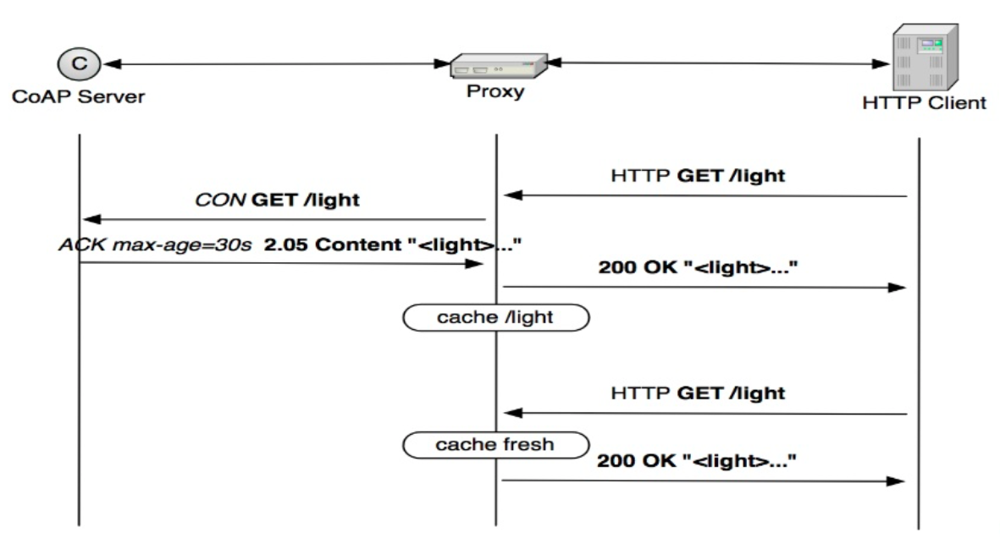{width=80%}


# CoAP V: HTTP vs CoAP

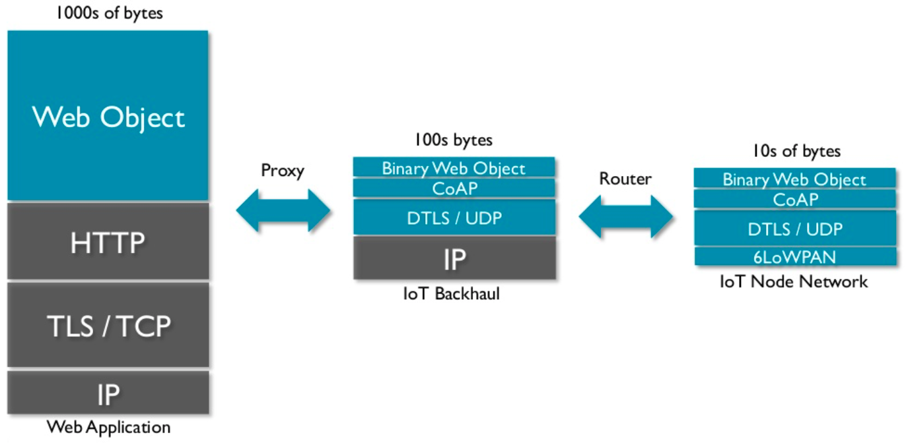{width=100%}


# CoAP VI: Functionalities

* URI
* `GET / POST / PUT / DELETE / PATCH / FETCH / iPATCH`
* Content-Type support (XML, JSON, CBOR,...)
* **built-in discovery** &mdash; `.well-known/core`
* **multicast support*** asynchronous message exchanges
* designed to be extensible
* congenial to IPv6

# CoAP VII: client / server

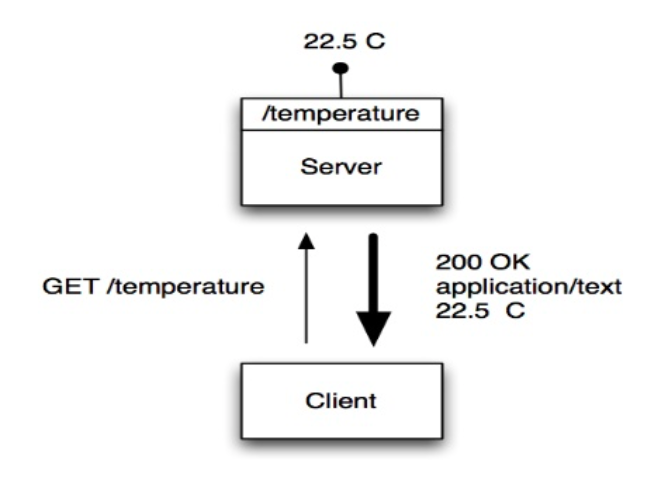{width=70%}

# CoAP VIII: message format

<br>

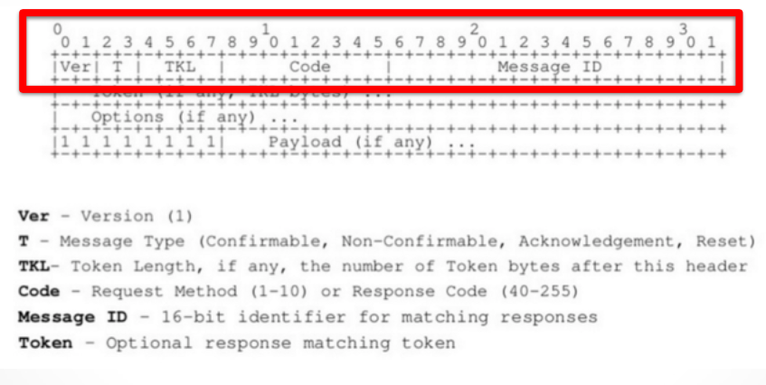{width=80%}

<!-- # CoAP frame -->

<!-- {\small  -->
<!-- ``` -->
<!-- 0                   1                   2                   3 -->
<!-- 0 1 2 3 4 5 6 7 8 9 0 1 2 3 4 5 6 7 8 9 0 1 2 3 4 5 6 7 8 9 0 1 -->
<!-- +-+-+-+-+-+-+-+-+-+-+-+-+-+-+-+-+-+-+-+-+-+-+-+-+-+-+-+-+-+-+-+-+ -->
<!-- |Ver| T |  TKL  |      Code     |          Message ID           | -->
<!-- +-+-+-+-+-+-+-+-+-+-+-+-+-+-+-+-+-+-+-+-+-+-+-+-+-+-+-+-+-+-+-+-+ -->
<!-- |   Token (if any, TKL bytes) ... -->
<!-- +-+-+-+-+-+-+-+-+-+-+-+-+-+-+-+-+-+-+-+-+-+-+-+-+-+-+-+-+-+-+-+-+ -->
<!-- |   Options (if any) ... -->
<!-- +-+-+-+-+-+-+-+-+-+-+-+-+-+-+-+-+-+-+-+-+-+-+-+-+-+-+-+-+-+-+-+-+ -->
<!-- |1 1 1 1 1 1 1 1|    Payload (if any) ... -->
<!-- +-+-+-+-+-+-+-+-+-+-+-+-+-+-+-+-+-+-+-+-+-+-+-+-+-+-+-+-+-+-+-+-+ -->
<!-- ``` -->


# CoAP IX: confirmable  messages

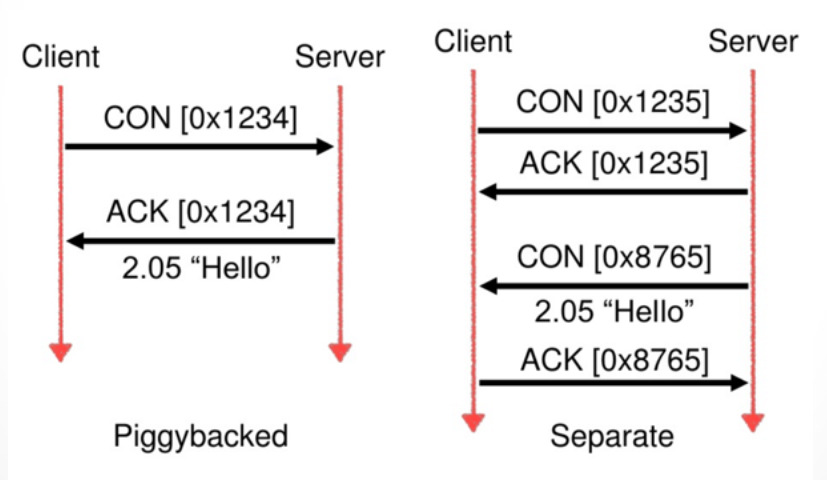{height=300px}

# CoAP X: non-confirmable messages

<br/>
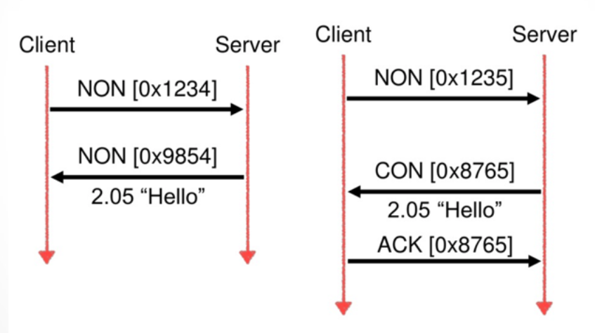{height=300px}


# CoAP XI: reset

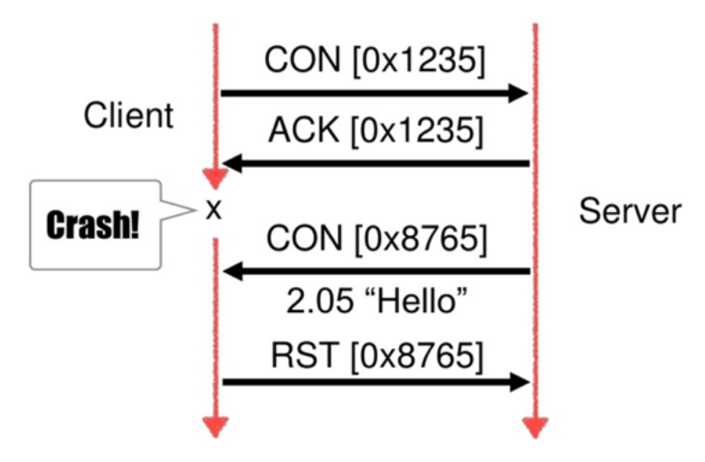{height=300px}

# CoAP XII: reliability

<br/>

* message reliability is handled at the application layer (UDP)
* congestion control &mdash; retransmits increase exponentially up to 247 s
  &mdash; further improvements coming 
* these features can be disabled, if speed is the goal

# CoAP XIII: reliability continued

<br/>
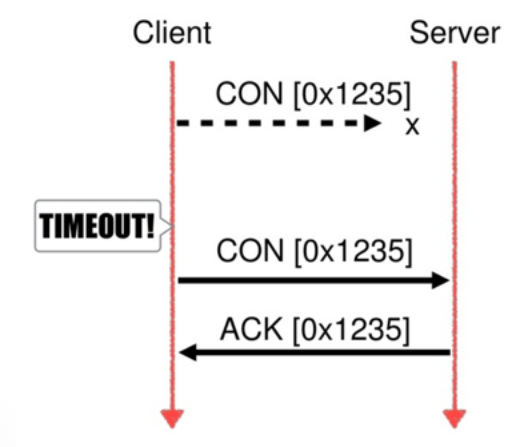{height=70%}


# CoAP observing resources I

<br/>

* protocol extension for CoAP: RFC 7641
* client interested in a resource over period of time
* observer pattern
* server$\approx$ client (constrained device acts as a server)

# CoAP observing resources II

<br/>

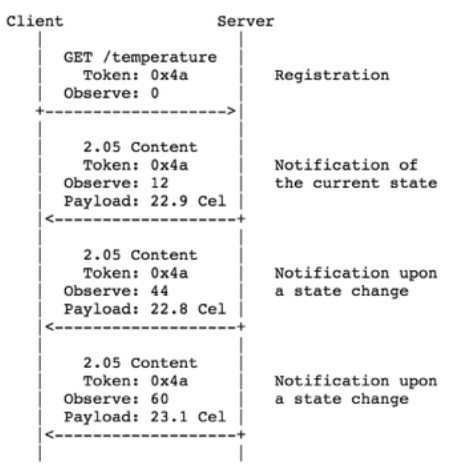{height=70%}

# CoAP observing resources III

<br/>

 * extension added later to the CoAP spec
 * transfers larger resource representations than can be usually accommodated in constrained networks
 * response is split in blocks
 * both sides have a say in the block size that actually will used

# CoAP security highlights I

 * CoAP over DTLS
 * multiple ways to distribute secret keys: **pre-shared**, **asymmetric
   unverified** and **certificate** based
 * ongoing [work](https://datatracker.ietf.org/wg/acme/documents/) to
   make certificate based more amenable to constrained devices
 * recent [CoAP over TCP](https://tools.ietf.org/html/rfc8323) RFC

# CoAP security highlights II

* Authorization relies in not so constrained devices being delegated
  by more constrained ones
* [Authentication and Authorization for Constrained Environments](https://datatracker.ietf.org/wg/ace/documents/) IETF working group
 * authentication & authorization inspired by OAUTH and JWT

# CoAP: improving on HTTP ideas - FETCH & iPATCH

 * standard introduced in [RFC 8132](https://tools.ietf.org/html/rfc8132) &mdash; April 2017
 * `FETCH` makes it possible to have complex `GET` like operations w/o
   relying in long query strings or a *fake* `POST`
 * `iPATCH` is an idempotent way to `PATCH` a resource
 * few implementations of `FETCH` and `iPATCH`

# CoAP pubsub architecture I

 * working draft: [https://tools.ietf.org/html/draft-koster-core-coap-pubsub-05](https://tools.ietf.org/html/draft-koster-core-coap-pubsub-05)
 * CoAP brokers forward data from some nodes to others
 * broker and brokerless based approaches

# CoAP pubsub architecture II

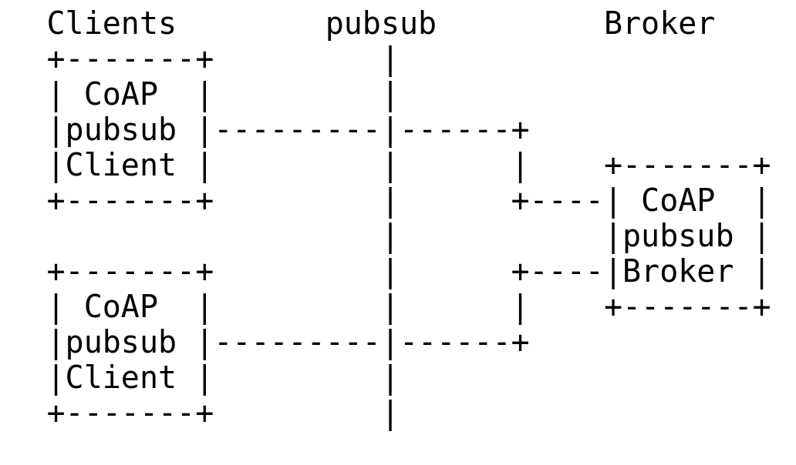{width=50%} 

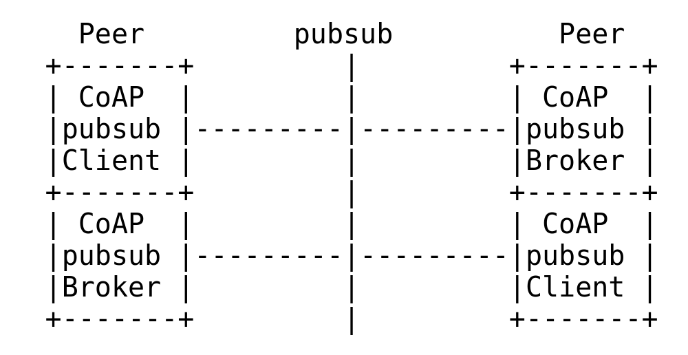{width=50%}

# learn more about CoAP

<br/>

* general info: **[`coap.technology`](http://coap.technology)**
* proposed standard: **[`tools.ietf.org/html/rfc7252`](https://tools.ietf.org/html/rfc7252)**
* copper (CoAP user-agent ~~as a Firefox add-on~~):
  **[`github.com/mkovatsc/Copper`](https://github.com/mkovatsc/Copper)**
* several tutorials and cool features to discover

