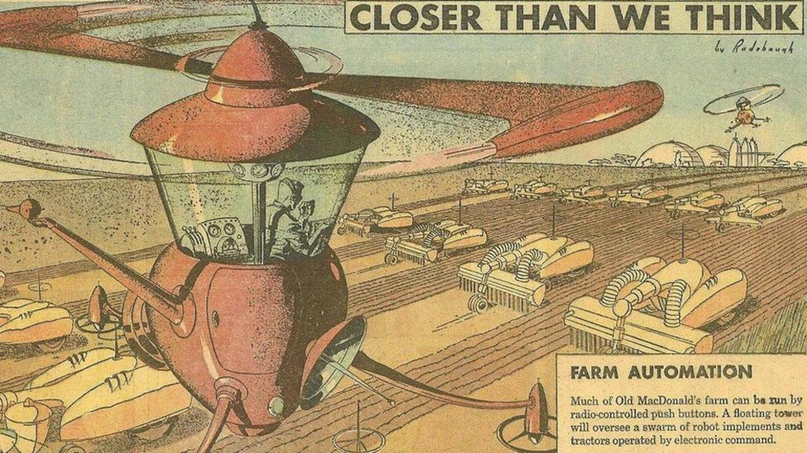
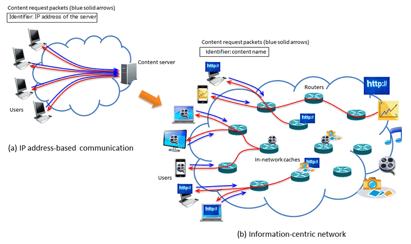

# a glimpse into the future

{width=100%}

# Information Centric Networking (ICN) vs Host Centric Networking (HCN)

{width=80%}

 * HCN: conversation between **hosts** &mdash; **who** to talk to.
 * ICN: spreads **data** objects &mdash; **what** to say

# Data Distribution Service (DDS)

{width=80%}

# DDS in a nutshell

* has been around for some time &mdash; DDS 1.0 (2005).
* main entities:
	* Domain Participant
	* Data Writer
	* Publisher
	* Data Reader
	* Subscriber
	* Topic 
* all networking is abstracted: usually implemented on top of raw sockets
* anycasting and multicasting
    
# ICN in a nutshell I

* shares **packet forwarding** with IP mostly
* data **consumers** and **data producers** as main entities
* data reliability is a main point
* follows brodcast model: **one** producer for **many** consumers

# ICN request/response outline
	
 * **Consumer** requests **named data**: **Interest**
 * **Interest** is forwarded to a place (or places) where named data exists
 * **Forwarder** records the interface on which the Interest was received
 * **Data** is returned in a **Content** message
 * Data in content is **signed** to avoid tampering

lots of caching strategies possible &mdash; see the web

# ICN in a nutshell II
  
* **communication** between **consumers** and **named data**
* **forwarders** interact with messages and maintain a state per-message ($\neq$ IP)
* **data name** instead of IP address
* anycasting and multicasting
* **consumer** can roam &mdash; easy mobility

# ICN in a nutshell III

* research topic: NSF funded [Named Data Networking](http://named-data.net/)
* many open questions
* routing
	* congestion control
	* push (event) also, not only polling
* multiple research projects: US, Europe
* watch this space
