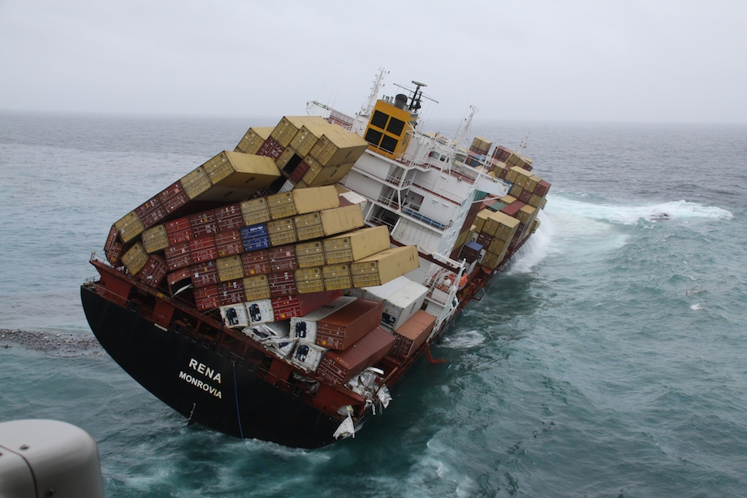

# demo time

{width=80%}

# demo details

 * CoAP web client interacting with the
   <coap://californium.eclipse.org:5683> test server
 * using [Copper](https://github.com/mkovatsc/Copper) ~~Firefox~~
   extension with the [Basilik](https://www.basilisk-browser.org/)
   browser
 * no longer works with Firefox after version 56
 * extension needs to be installed from source
 * as an alternative browser with a retro look: [Pale Moon](https://www.palemoon.org/)
